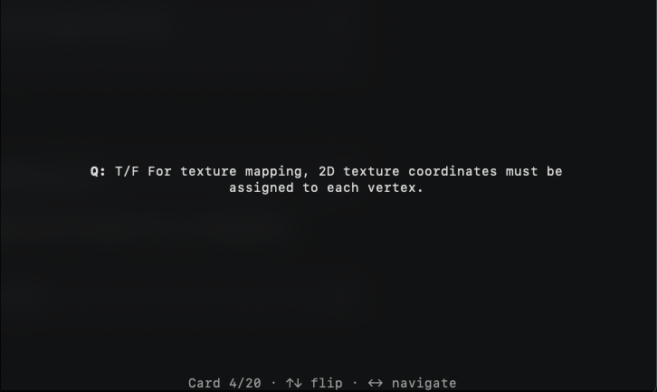

# fcards: cli flashcards

## installation

``` bash
git clone https://github.com/bwally0/fcards
cd ./fcards
pip install .
```

## usage

``` bash
fcards ./examples/cse470-final.txt
```

fcards takes one argument which is the path to the .txt containing you flashcards:
``` bash
fcards <path/to/cards.txt>
```



- use left and right arrow to switch cards
- use up and down arrow to flip card
- use ctrl+q to quit application

## cards.txt format

to create new flashcard set, create a text file with the following format:
```
Q>your question here
A>your answer here

Q>your question here
A>your answer here

# this is a comment, it's ignored
```